# AI Workshop Presentation

This document contains slides from the AI Workshop presentation.

## Table of Contents

- [Introduction](#introduction)
- [Tasks Overview](#tasks-overview)
- [Implementation Details](#implementation-details)
- [Conclusion](#conclusion)

## Introduction

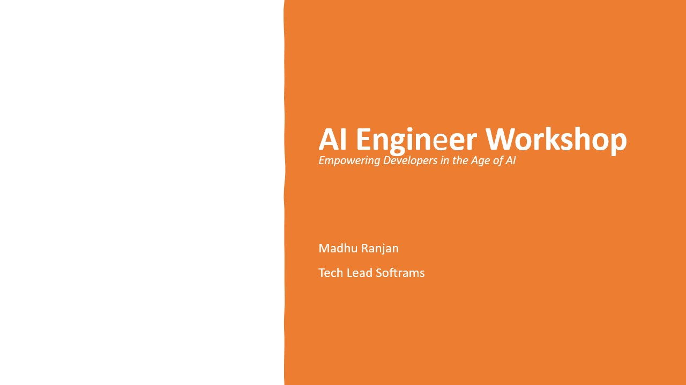

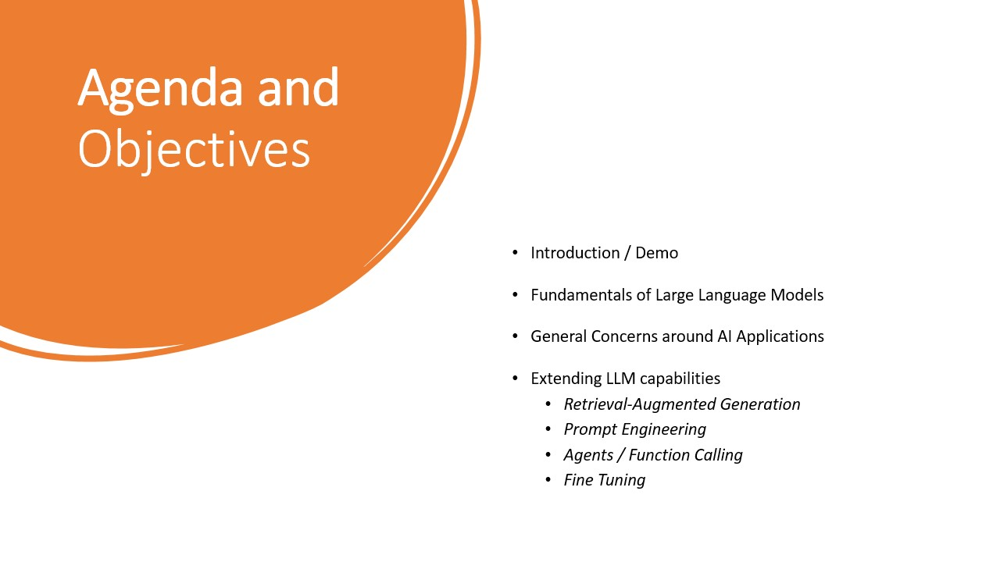

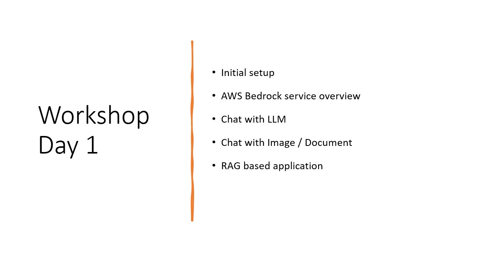

## Tasks Overview

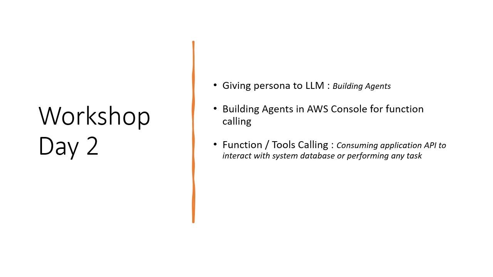

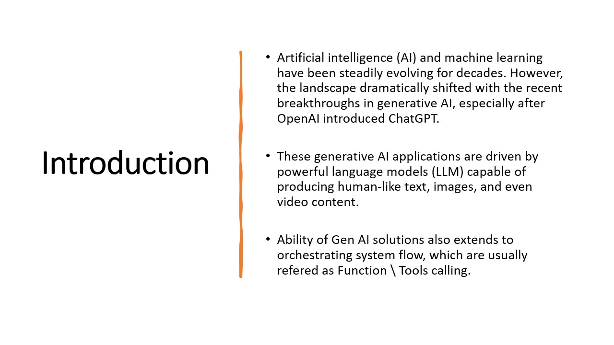

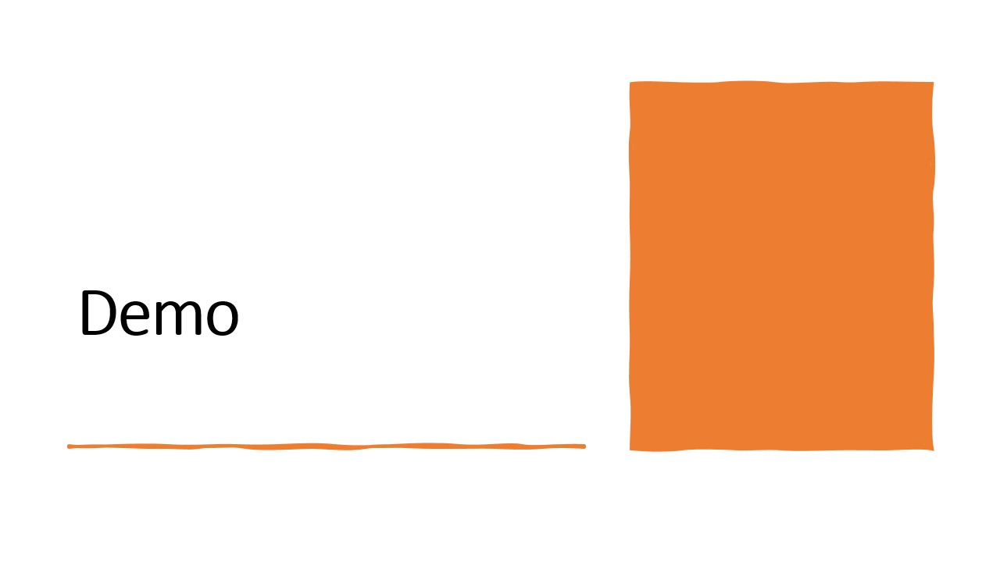

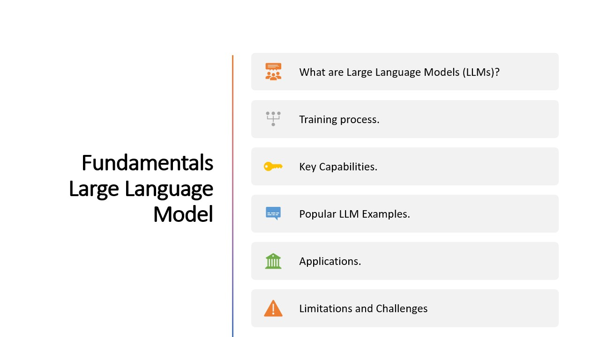

## Implementation Details

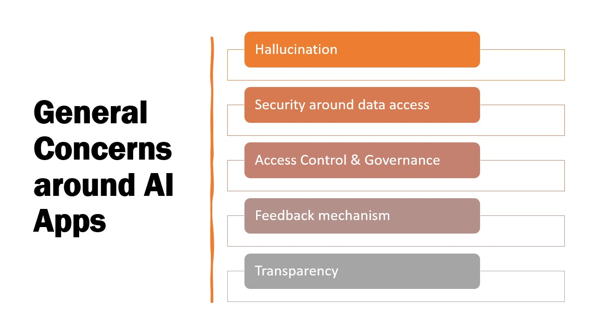

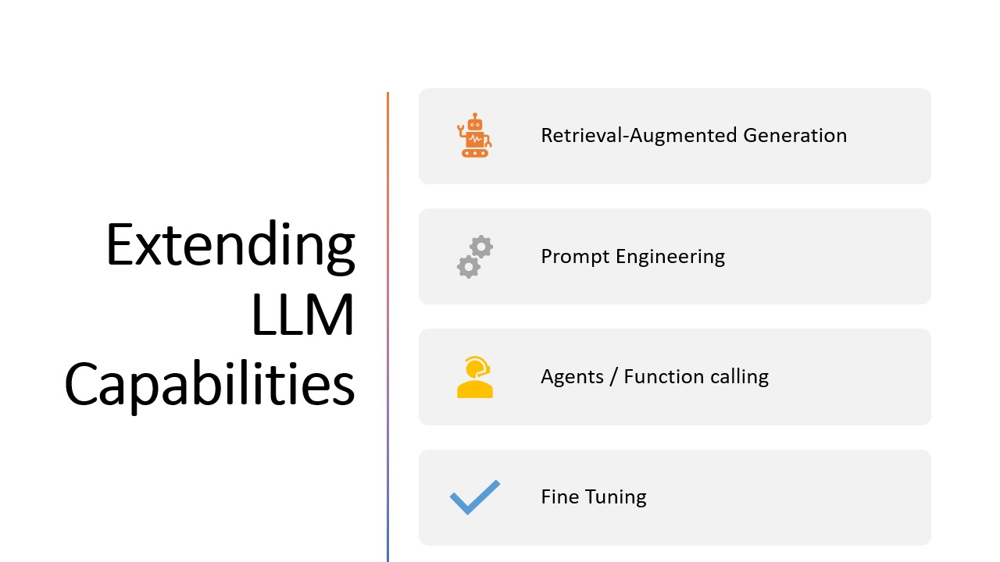

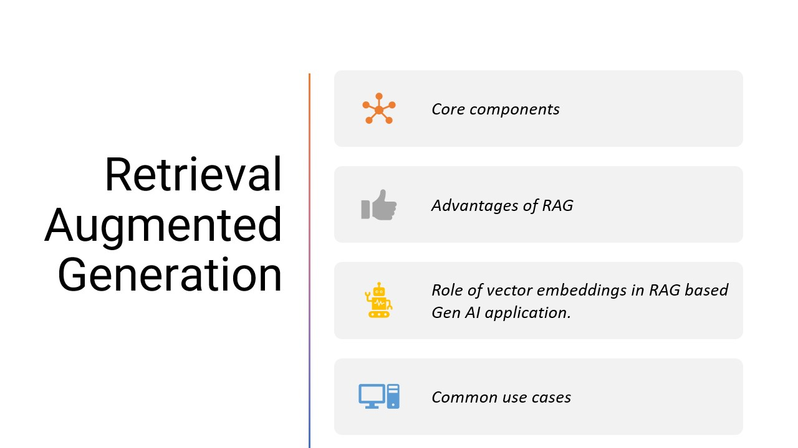

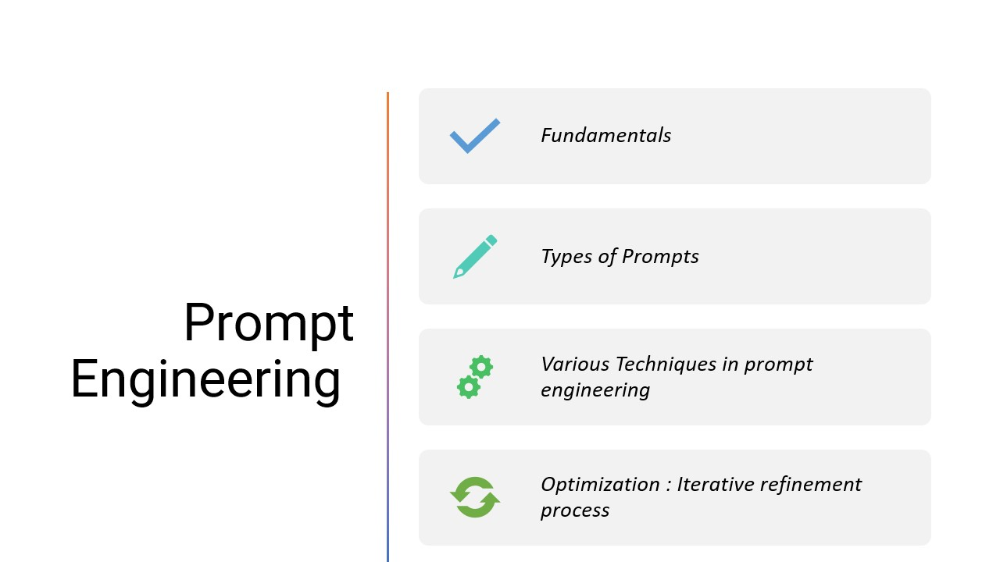

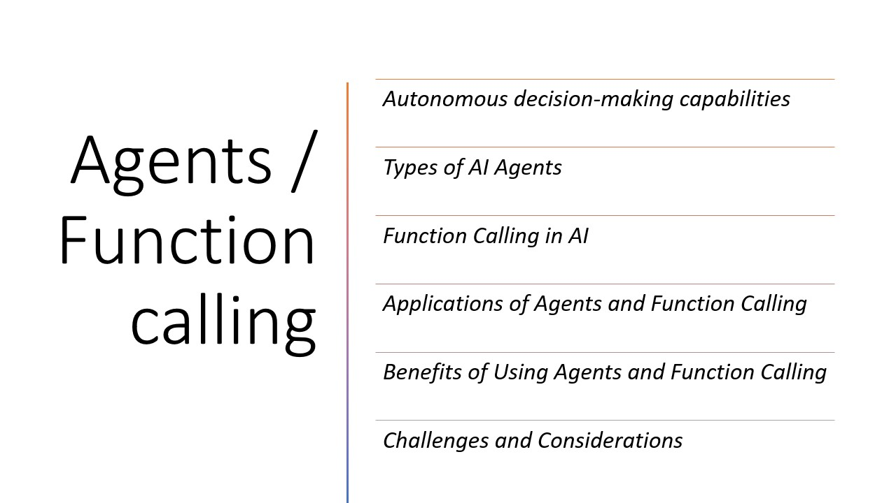

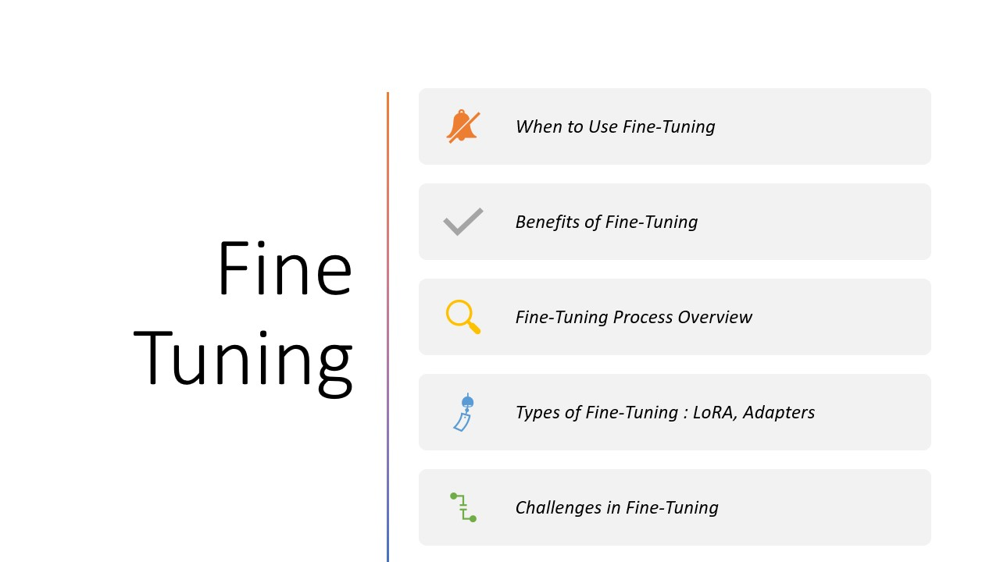

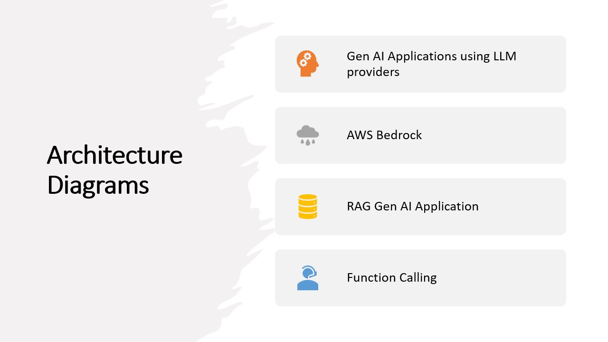

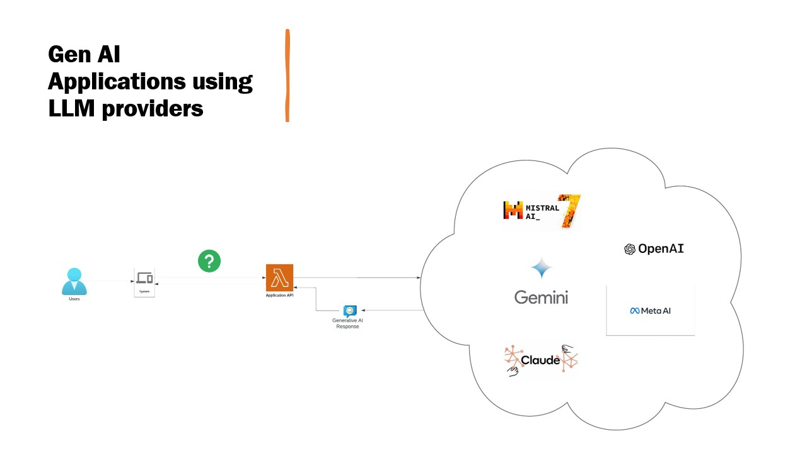

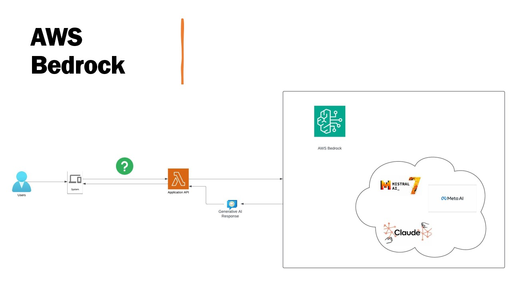

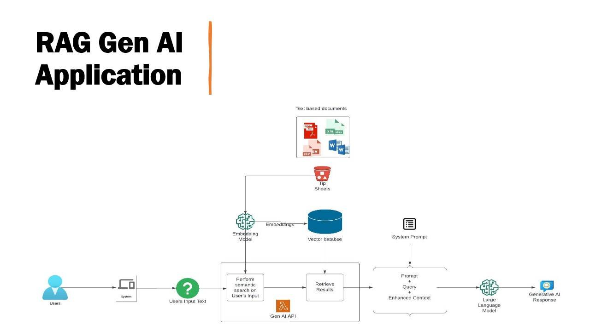

## Conclusion

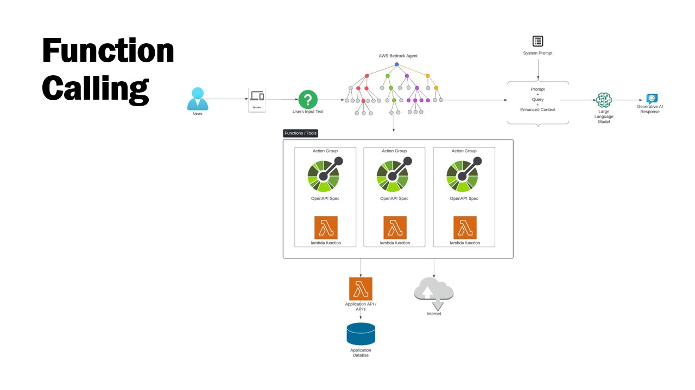

## How to Use This Workshop

1. Follow the tasks in order, starting with [Task 1: Initial Setup](tasks/task1-initial-setup.md)
2. Each task builds on the previous one, adding new capabilities to your AI application
3. The complete implementation details can be found in the task markdown files
4. If you get stuck, refer to the provided resources or check the repository for the complete code

## Resources

- [AWS Bedrock Documentation](https://docs.aws.amazon.com/bedrock/)
- [GitHub Repository](https://github.com/ranjanmadhu/ai-workshop)